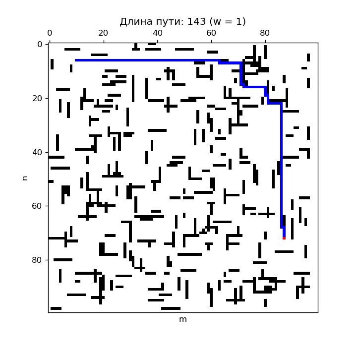

## 1. Домашняя работа

#### Тема: ***Решётчатая модель Больцмана D2Q9 для случая обтекания бесконечного цилиндра***

## 2. Лабораторная работа 4

#### Тема: ***Поиск пути в среде с преградами***

### Дано

Клеточное поле размером $m \times n$. Шаг между соседними клетками равен 1.

Поле заполнено заданным числом препятствий, расположенных случайным образом.
Каждое препятствие имеет единичную ширину и случайную длину в диапазоне длин от $l_{min}$ до $l_{max}$, выбираемую из равномерного распределения. Ориентация (горизонтальная или вертикальная) преграды на поле выбирается также случайным образом.

В районе левой части поля случайным образом выбирается свободная клетка. Обозначается как точка ${\bf P}_0$. В правой части аналогичным образом определяется точка ${\bf P}_1$.

* Размеры левой области, где генерируется точка ${\bf P} _0$:
  $x_{min}^{left} = 0$,
  $x_{max}^{left} = \left\lfloor n/5 \right\rfloor$,
  $y_{min}^{left} = 0$,
  $y_{max}^{left} = m$.
* Размеры правой области, где генерируется точка ${\bf P} _1$:
  $x_{min}^{right} = n - \left\lfloor n/5 \right\rfloor$,
  $x_{max}^{right} = n$,
  $y_{min}^{right} = 0$,
  $y_{max}^{right} = m$.

**Замечания:**

* Из каждой клетки возможны 4 перемещения: вверх, вправо, вниз, влево.

### Требуется

1. Найти кратчайший путь из точки ${\bf P}_0$ в точку ${\bf P}_1$, используя алгоритм эвристического поиска A*.
2. Показать решение графически.

### Результат

